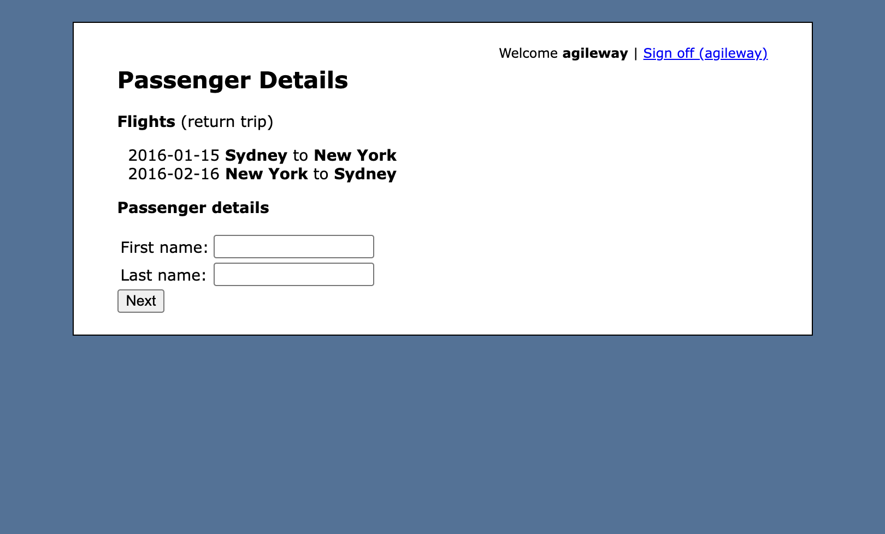

# Day 40: Agile Travel - Exploratory Testing

**Application:** [Agile Travel](https://travel.agileway.net)  
**Testing focus:** Flight booking workflow and API endpoints  
**Browser evidence captured:** Chromium on macOS

## Findings

| ID | Defect | Severity | Priority | Evidence |
| --- | --- | --- | --- | --- |
| 01 | Core API endpoints reportedly return `502 Bad Gateway` | Critical | P1 - Urgent | [Postman collection](Evidence/01-502%20Bad%20Gateway%20Errors.collection.json), [Postman environment](Evidence/01-502%20Bad%20Gateway%20Errors.environment.json) |
| 02 | Past flight dates are accepted and proceed to passenger details | Medium | P2 - Normal | [Itinerary screenshot](Evidence/02-Past-Flight-Dates-Accepted.png) |

Detailed reports: [Defects_&_Bugreports](Defects_&_Bugreports/).

---

## 01 - Core API Endpoints Return 502 Bad Gateway

**Title:** [API / Gateway Defect] AgileTravel backend endpoints return 502 Bad Gateway HTTP status responses during API test execution

**User impact:** Requests to core authentication, flight selection, and passenger booking functionality are expected to return usable responses. Instead, the existing report records gateway errors that block API testing and use of those endpoints.

**Environment:** Postman API Client or another REST client; desktop/API server environment; OS not specified in the original report.  
**Collection:** `Module-3_Day-40_AgileTravel_API_Tests`  
**Base URL:** `https://travel.agileway.net`

### Steps to reproduce

1. Import the [Postman collection](Evidence/01-502%20Bad%20Gateway%20Errors.collection.json).
2. Configure `baseUrl`, `username`, and `password` in the [Postman environment](Evidence/01-502%20Bad%20Gateway%20Errors.environment.json).
3. Run the requests sequentially: `POST /login`, `GET /flights/select_date`, and `POST /flights/passenger`.
4. Inspect the HTTP status codes.

### Actual result

The existing bug report states that the server returns `502 Bad Gateway` for these core requests, preventing successful API testing and server communication.

### Expected result

The endpoints should process valid requests and return the expected successful response (such as `200 OK` or `302 Found`), as appropriate for each route.

**Severity:** Critical - reported as completely blocking API testing and server communication.  
**Priority:** P1 - Urgent - investigate gateway routing, upstream availability, and application/gateway logs.

**Evidence available:** The Postman collection contains the endpoint requests and response assertions; the environment file supplies the collection variables. The original evidence consists of these Postman artifacts; no response capture or screenshot is included. The environment file may contain credentials; do not copy secrets into reports or share the file publicly.

**Detailed report:** [01-502 Bad Gateway Errors.md](Defects_&_Bugreports/01-502%20Bad%20Gateway%20Errors.md)

---

## 02 - Past Flight Dates Are Accepted

**Title:** [Flight Search / Date Validation Defect] Past departure and return dates are accepted and proceed to passenger details

**User impact:** A traveler can proceed with an impossible itinerary using dates that have already passed.

**Environment:** macOS, Chromium, desktop browser  
**Starting page:** [Agile Travel flight search](https://travel.agileway.net/flights/start)

### Steps to reproduce

1. Sign in to Agile Travel and open the Select Flight page.
2. Select Sydney as the origin and New York as the destination.
3. Select January 15, 2016 as the departure date and February 16, 2016 as the return date.
4. Click **Continue**.
5. Inspect the itinerary on the Passenger Details page.

### Actual result

The application accepts both dates in the past and advances to Passenger Details, displaying a return itinerary for January 15 and February 16, 2016.

### Expected result

Past dates should not be offered as selectable options or accepted by the server. The application should require a valid future itinerary and show a clear validation message for an invalid date.

**Severity:** Medium - permits an impossible itinerary but occurs before passenger or payment submission.  
**Priority:** P2 - Normal - correct date options and validate dates server-side.

**Evidence:** The screenshot below shows the Passenger Details page with the accepted 2016 itinerary.



**Detailed report:** [02-Past Flight Dates Accepted.md](Defects_&_Bugreports/02-Past%20Flight%20Dates%20Accepted.md)

### Folder & Artifact Structure

```text
Module-3-Buggy-Exploratory/
└── Day-40-AgileTravel/
    ├── README.md
    ├── Defects_&_Bugreports/
    │   ├── 01-502 Bad Gateway Errors.md
    │   └── 02-Past Flight Dates Accepted.md
    └── Evidence/
        ├── Screenshots/
        ├── 01-502 Bad Gateway Errors.collection.json
        ├── 01-502 Bad Gateway Errors.environment.json
        └── 02-Past-Flight-Dates-Accepted.png